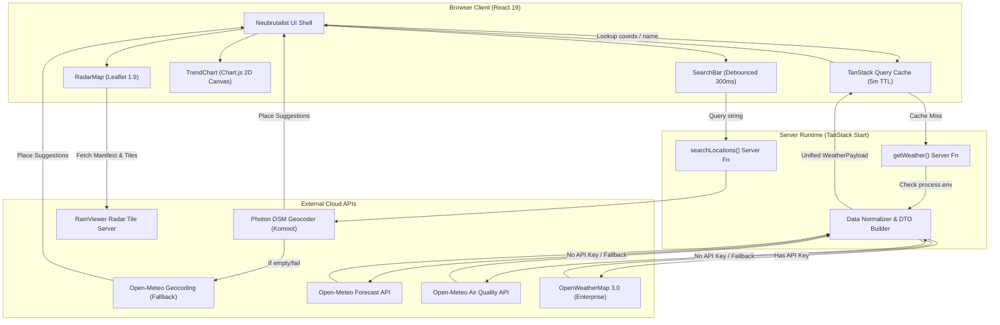
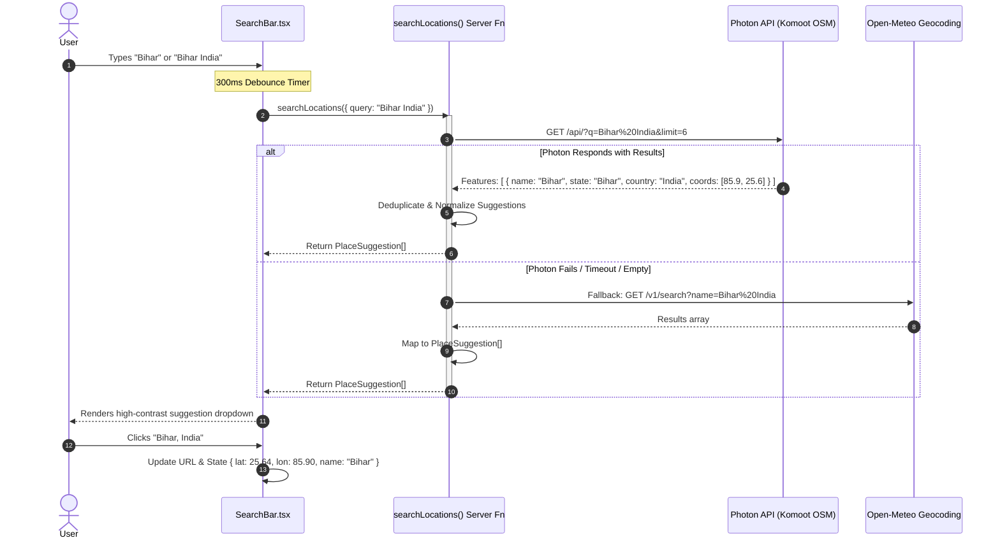
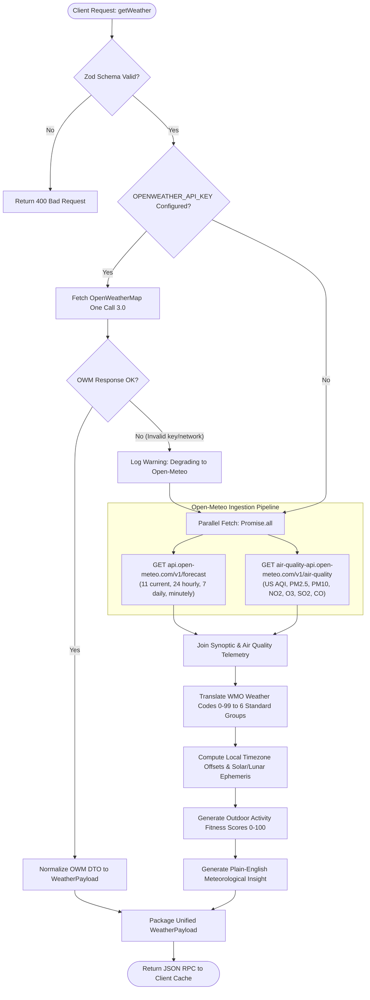
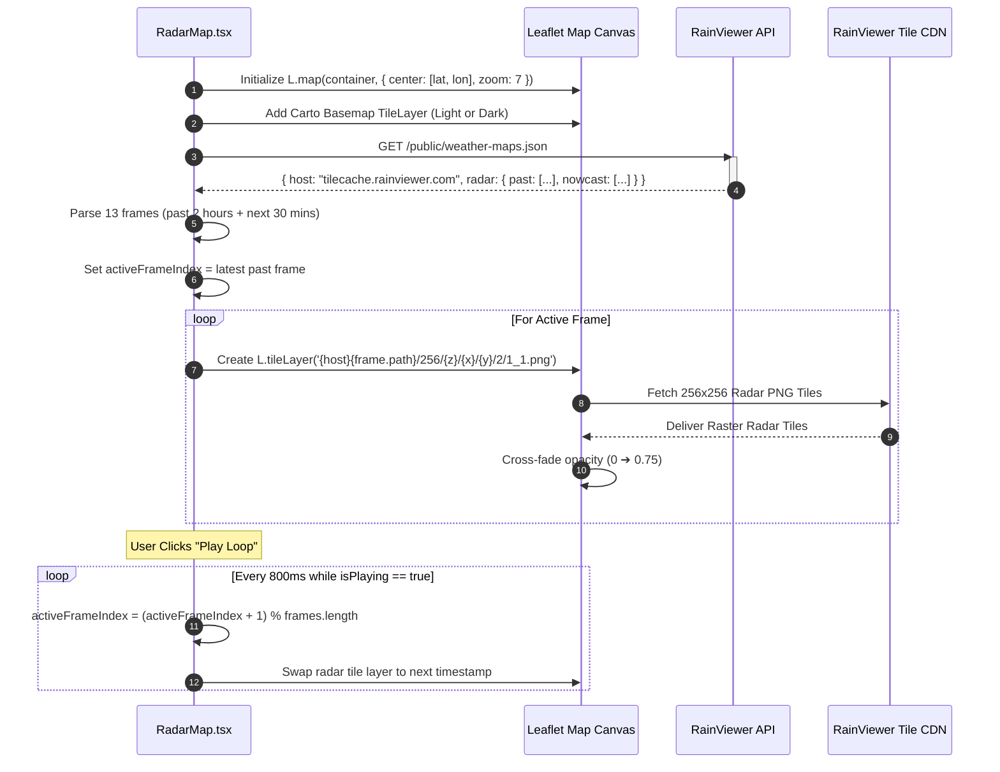
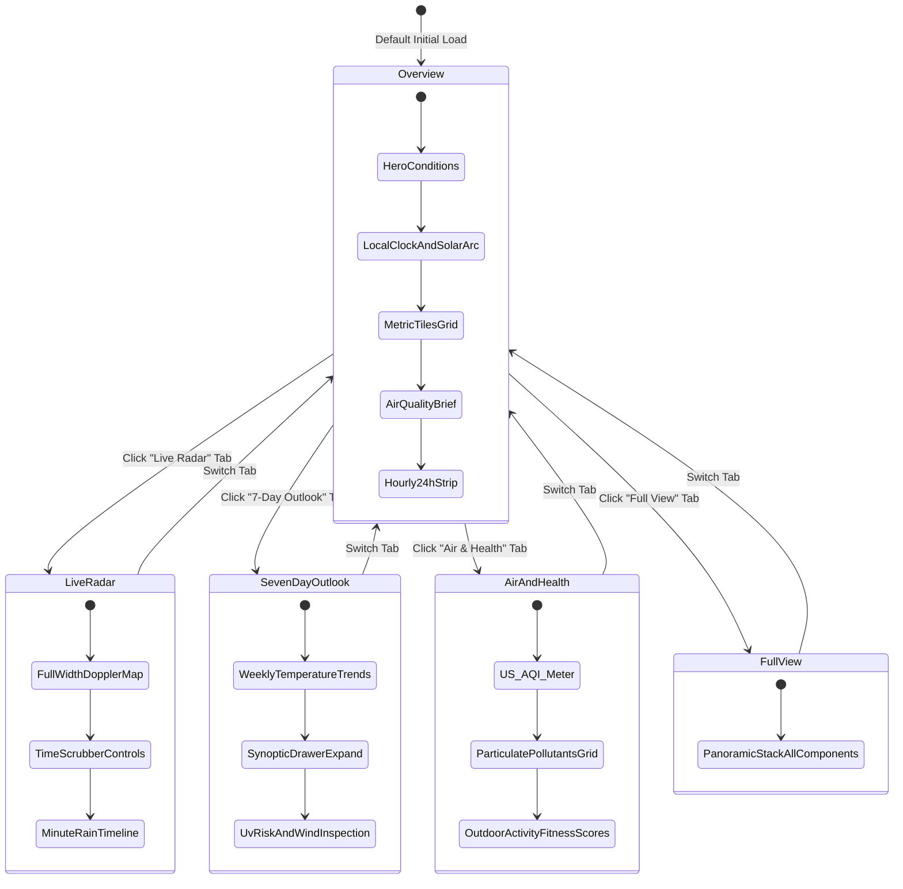
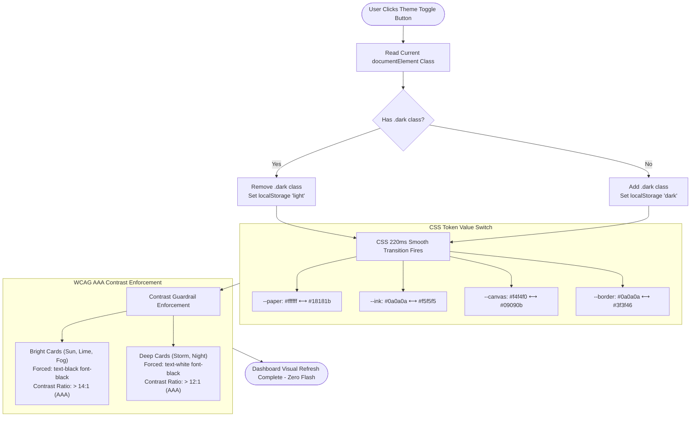

# NowCast ⚡ System Architecture, Workflow & Technical Design

> **Executive Summary**: This document provides a comprehensive deep-dive into the architectural foundations, end-to-end data workflows, technology choices and rationales, and step-by-step flowcharts powering **NowCast** — an enterprise-grade, full-stack SSR meteorological intelligence platform engineered with TanStack Start, React 19, and a high-contrast Neubrutalist design system.

---

## 📑 Table of Contents

1. [High-Level Architectural Paradigm](#1-high-level-architectural-paradigm)
2. [System Topology & Component Hierarchy](#2-system-topology--component-hierarchy)
3. [Technology Stack: What is Used and Why It Is Used](#3-technology-stack-what-is-used-and-why-it-is-used)
4. [End-to-End Workflows (Step-by-Step)](#4-end-to-end-workflows-step-by-step)
   - [Workflow 1: Application Boot, Calibration & Hydration](#workflow-1-application-boot-calibration--hydration)
   - [Workflow 2: Smart Search & Geocoding Cascade](#workflow-2-smart-search--geocoding-cascade)
   - [Workflow 3: Meteorological Data Ingestion & Normalization](#workflow-3-meteorological-data-ingestion--normalization)
   - [Workflow 4: Real-Time Doppler Radar & Satellite Streaming](#workflow-4-real-time-doppler-radar--satellite-streaming)
   - [Workflow 5: Dual-Theme Contrast & Transition Engine](#workflow-5-dual-theme-contrast--transition-engine)
5. [Step-by-Step Flowcharts (Mermaid)](#5-step-by-step-flowcharts-mermaid)
   - [Flowchart 1: Complete System Data Flow](#flowchart-1-complete-system-data-flow)
   - [Flowchart 2: Multi-Tier Geocoding Resolution Cascade](#flowchart-2-multi-tier-geocoding-resolution-cascade)
   - [Flowchart 3: Meteorological Ingestion & Schema Normalization](#flowchart-3-meteorological-ingestion--schema-normalization)
   - [Flowchart 4: Live Doppler Radar Tile Sync & Playback Engine](#flowchart-4-live-doppler-radar-tile-sync--playback-engine)
   - [Flowchart 5: Dashboard View Mode State Machine](#flowchart-5-dashboard-view-mode-state-machine)
   - [Flowchart 6: Theme Switching & Contrast Safety Pipeline](#flowchart-6-theme-switching--contrast-safety-pipeline)
6. [Data Contracts & Schema Normalization](#6-data-contracts--schema-normalization)
7. [Security, Performance & Production Engineering](#7-security-performance--production-engineering)

---

## 1. High-Level Architectural Paradigm

NowCast is built upon four fundamental engineering tenets:

```
┌────────────────────────────────────────────────────────────────────────┐
│                        NOWCAST DESIGN PRINCIPLES                       │
├────────────────────┬────────────────────┬──────────────────────────────┤
│ 1. ZERO SECRETS ON │ 2. KEYLESS BY      │ 3. DUAL-ENGINE GEOCODING     │
│    THE CLIENT      │    DEFAULT         │    CASCADE                   │
│ Server RPC functions│ Open-Meteo +      │ Photon OSM + Open-Meteo       │
│ hide all credentials│ RainViewer zero-key│ fallback guarantees accurate │
│ from browser bundles│ baseline readiness │ regional/state query matching│
├────────────────────┼────────────────────┼──────────────────────────────┤
│ 4. NEUBRUTALIST    │ 5. ISOMORPHIC SSR  │ 6. WCAG AAA CONTRAST         │
│    INFORMATION     │    HYDRATION       │    SAFETY                    │
│ Tactile 3px borders│ Fast first-paint   │ Strict black/white ink rules │
│ & spring-physics   │ via route loaders  │ prevent low-contrast text on │
│ visual hierarchy   │ & cached queries   │ vibrant colored backgrounds  │
└────────────────────┴────────────────────┴──────────────────────────────┘
```

1. **Zero Secret Leakage**: API tokens (such as `OPENWEATHER_API_KEY`) reside exclusively within server execution environments. The client receives only normalized, sanitized Data Transfer Objects (DTOs).
2. **Keyless Out-of-the-Box Operation**: Zero required API keys for baseline operation. The platform orchestrates keyless public endpoints (**Open-Meteo Weather**, **Open-Meteo Air Quality**, **Photon Komoot OpenStreetMap Geocoding**, and **RainViewer Radar**) to function out of the box.
3. **Resilient Provider Cascade**: Every external I/O call implements automated degradation and fallback mechanisms. If primary endpoints fail or throttle, secondary providers silently absorb the load.
4. **Deterministic UI State**: The user interface is driven by a single source of truth (`WeatherPayload`) consumed through strongly-typed React 19 components and animated via hardware-accelerated spring physics.

---

## 2. System Topology & Component Hierarchy

The system is separated into three distinct operational tiers:

```
[ CLIENT BROWSER TIER ]
  │
  ├── UI Shell (React 19, HTML5, Lucide Icons)
  ├── Motion Engine (Framer Motion / motion/react)
  ├── Geospatial Radar Layer (Leaflet 1.9 + RainViewer Tile Layers)
  ├── Synoptic Visualizer (Chart.js 4.5 + HTML5 2D Canvas)
  └── Client Store (TanStack Query Cache + LocalStorage Preferences)
        ▲
        │ JSON RPC over HTTP (createServerFn)
        ▼
[ SERVER EXECUTION TIER (TanStack Start / Node / Nitro / Edge) ]
  │
  ├── Route Loader: routes/index.tsx (Pre-fetches default city on SSR)
  ├── Server RPC Endpoints: lib/weather.functions.ts
  │     ├── getWeather()       (Zod validation: lat, lon, query)
  │     └── searchLocations()  (Zod validation: query min 2 chars)
  └── Orchestrator & Normalizer: lib/weather.server.ts
        ├── Multi-Provider Geocoder (Photon OSM ➔ Open-Meteo ➔ OWM)
        ├── Weather Ingestor (Open-Meteo ➔ OpenWeatherMap 3.0 Adapter)
        ├── Atmospheric Air Quality Aggregator (US EPA / European EAQI)
        └── WMO Code to Synoptic Matrix Translator
        ▲
        │ HTTPS REST Calls (Accept: application/json)
        ▼
[ UPSTREAM CLOUD DATA PROVIDERS ]
  ├── Photon Geocoding API (photon.komoot.io)
  ├── Open-Meteo Weather Forecast API (api.open-meteo.com)
  ├── Open-Meteo Air Quality API (air-quality-api.open-meteo.com)
  ├── RainViewer Radar & Satellite API (api.rainviewer.com)
  ├── OpenStreetMap Carto Basemap Tiles (tile.openstreetmap.org)
  └── OpenWeatherMap One Call 3.0 API (Optional Enterprise Secret)
```

---

## 3. Technology Stack: What is Used and Why It Is Used

Every dependency, library, and tool in NowCast was chosen to maximize performance, visual feedback, and developer velocity while avoiding vendor lock-in.

| Technology                     | Layer                    | What It Is                                                                                   | Why It Was Chosen                                                                                                                                                        | Evaluated Alternatives & Trade-offs                                                                                                                                                                             |
| :----------------------------- | :----------------------- | :------------------------------------------------------------------------------------------- | :----------------------------------------------------------------------------------------------------------------------------------------------------------------------- | :-------------------------------------------------------------------------------------------------------------------------------------------------------------------------------------------------------------- |
| **TanStack Start**             | Fullstack Framework      | Isomorphic full-stack React framework built on Vinxi/Nitro.                                  | Provides native Server Functions (`createServerFn`), streaming SSR, and zero-overhead API routes without requiring a dedicated backend server. Seamless edge deployment. | **Next.js**: Higher boilerplate, complex caching defaults, larger bundle overhead.<br>**Remix**: Excellent, but TanStack Start offers tighter integration with TanStack Query & Router.                         |
| **TanStack Router**            | Client & Server Routing  | Fully type-safe router with first-class search param validation.                             | Guaranteed type safety across route params and search state. Eliminates runtime navigation bugs and synchronizes weather location directly with URL search parameters.   | **React Router v6**: Lacks 100% compile-time type-safe search param validation out of the box.                                                                                                                  |
| **TanStack Query (v5)**        | State & Data Fetching    | Asynchronous server-state manager with intelligent caching.                                  | Manages data caching (5-min `staleTime`), background refetching, deduplication of in-flight requests, and optimistic UI transitions.                                     | **Redux / Zustand**: Overkill for server-derived data; requires manual cache invalidation, loading states, and error handling.                                                                                  |
| **React 19**                   | View Layer               | Modern UI rendering library with Concurrent features.                                        | Fast DOM reconciliation, modern hooks (`useActionState`, `useOptimistic`), and lightweight runtime footprint.                                                            | **React 18**: Lacks modern compilation optimizations and concurrent server component enhancements.                                                                                                              |
| **Tailwind CSS v4**            | Design System Engine     | High-performance CSS utility compiler with lightningcss.                                     | Instant compilation, zero CSS bundle bloat, CSS-first `@theme` configuration, and dynamic custom property binding for theme switching.                                   | **Tailwind v3**: Slower PostCSS compilation; relies on complex JS configuration files.<br>**CSS Modules**: Lacks cohesive design token sharing and rapid prototyping speed.                                     |
| **Neubrutalist Custom Tokens** | Design Paradigm          | High-contrast visual language (3px ink borders, 4px hard drop shadows, vibrant pop palette). | Drastically improves scannability in direct sunlight or dim conditions. Provides an unforgettable, executive-grade tactile aesthetic.                                    | **Glassmorphism / Flat Design**: Poor contrast in varying ambient light; visual monotony; low information density.                                                                                              |
| **Framer Motion (`motion`)**   | Animation Engine         | Production-ready declarative animation and gesture library.                                  | Spring physics (`type: "spring", stiffness: 350, damping: 25`), automatic layout morphing (`layoutId`), and exit transitions via `<AnimatePresence mode="wait">`.        | **Plain CSS Animations**: Difficult to orchestrate dynamic multi-card unmount/mount states.<br>**GSAP**: Heavier bundle size, imperative imperative syntax.                                                     |
| **Leaflet 1.9**                | Geospatial Radar         | Mobile-friendly interactive mapping engine.                                                  | Extremely lightweight (<42 KB gzipped), battle-tested, zero API key requirement, and native support for dynamic raster tile overlays and custom HTML markers.            | **Mapbox GL / MapLibre**: Requires WebGL context, heavier memory footprint, overkill for 2D weather radar overlays.<br>**Google Maps SDK**: Expensive billing, heavy JS footprint, strict API key requirements. |
| **RainViewer API**             | Meteorological Radar     | Global Doppler precipitation radar and satellite tile provider.                              | Free, keyless public API delivering real-time precipitation radar and infrared satellite frames with 10-minute cadence and global coverage.                              | **OpenWeather Radar 2.0**: Requires paid enterprise subscription; limited historical time-scrubbing.                                                                                                            |
| **Chart.js 4.5 + Canvas**      | Data Visualization       | Hardware-accelerated HTML5 2D Canvas charting library.                                       | Renders 24-hour temperature curves and 7-day high/low bands with 60fps responsiveness. Zero DOM node overhead compared to SVG charts on mobile devices.                  | **Recharts (SVG)**: Creates dozens of DOM nodes per point, degrading performance on low-end mobile devices during rapid view transitions.                                                                       |
| **Photon (Komoot OSM)**        | Geocoding Engine         | Search engine based on OpenStreetMap data by Komoot.                                         | Solves administrative division matching: accurately parses states (e.g. `"Bihar"`), regions, and multi-word queries (e.g. `"Bihar India"`) that fail in other geocoders. | **Google Places API**: High recurring costs and billing requirement.<br>**Open-Meteo Geocoding**: Fails on multi-word state/country combinations.                                                               |
| **Open-Meteo Forecast & AQI**  | Meteorological Telemetry | Synoptic weather and air quality API based on DWD/ECMWF models.                              | High-precision numerical weather models (ECMWF, GFS, ICON), minute-by-minute rain, comprehensive hourly forecast, and full particulate AQI without API key friction.     | **WeatherAPI / AccuWeather**: Aggressive rate limits on free tiers; paywalled hourly and air quality data.                                                                                                      |
| **OpenWeatherMap 3.0 Adapter** | Secondary Provider       | Enterprise weather API adapter for One Call 3.0.                                             | Provides production fallback when enterprise users supply an `OPENWEATHER_API_KEY`. Server functions seamlessly toggle between providers.                                | **Single-provider dependency**: Creates single point of failure during upstream cloud outages.                                                                                                                  |
| **Lucide React**               | Iconography              | Clean, consistent, lightweight SVG icon system.                                              | 100% tree-shakeable, customizable stroke widths (2.5px neubrutalist weight), and comprehensive meteorological glyphs.                                                    | **FontAwesome**: Bloated bundle size, complex font-face loading.                                                                                                                                                |
| **Zod**                        | Validation               | TypeScript-first schema declaration and validation library.                                  | Guarantees strict runtime boundary validation for all client inputs (`getWeather`, `searchLocations`) before executing upstream requests.                                | **Manual Type Guards**: Prone to human error, missed edge cases, and injection vulnerabilities.                                                                                                                 |

---

## 4. End-to-End Workflows (Step-by-Step)

### Workflow 1: Application Boot, Calibration & Hydration

```
[ BROWSER REQUEST ] ──> [ SSR LOADER ] ──> [ HTML + STATE ] ──> [ BOOT SEQUENCE ] ──> [ DASHBOARD READY ]
```

1. **Server-Side Route Loader**:
   - The browser requests `GET /`.
   - `src/routes/index.tsx` executes the route `loader`:
     ```ts
     await context.queryClient.ensureQueryData(weatherQuery(DEFAULT_LOOKUP));
     ```
   - TanStack Start renders the complete neubrutalist dashboard on the server for the default city (`Lisbon`), embedding the normalized weather DTO directly in the dehydrated HTML payload.
2. **Client Hydration**:
   - The browser receives fully-formed HTML with zero layout shift (CLS = 0).
   - React 19 hydrates the DOM, activating event listeners and the TanStack Query client cache.
3. **Atmospheric Radar Calibration (Intro Animation)**:
   - `IntroBootSequence.tsx` checks `sessionStorage.getItem("nowcast_intro_seen")`.
   - On first visit, a full-screen neubrutalist overlay locks the viewport.
   - A simulated 3-step synoptic calibration sequence runs (`01/03 INITIALIZING SYNOPTIC SENSORS...` ➔ `02/03 LOCKING LIVE DOPPLER RADAR TILES...` ➔ `03/03 NOWCAST ENGINE READY`).
   - A spring-loaded curtain slide (`y: "-100%"`) unveils the live dashboard.
   - The sequence can be re-triggered anytime by clicking the animated `NowCastLogo` in the header.
4. **Local Preferences Handshake**:
   - `useWeatherPrefs` reads user settings from `localStorage` (`nowcast_temp_unit`, `nowcast_favorites`, `nowcast_recents`, `nowcast_radar_layer`).
   - If the user had previously saved a home city, the dashboard seamlessly transitions to their saved location.

---

### Workflow 2: Smart Search & Geocoding Cascade

```
[ USER TYPING ] ──(300ms Debounce)──> [ searchLocations() RPC ] ──> [ PHOTON OSM ]
                                                                           │
                                      [ CLIENT DROPDOWN ] ◄── [ OPEN-METEO FALLBACK ]
```

1. **User Interaction**:
   - User types `"bihar india"` or `"tokyo"` into `SearchBar.tsx`.
   - The input is debounced by **300ms** to prevent upstream flooding.
2. **Server Function RPC Call**:
   - Client invokes `searchLocations({ query })` via TanStack Start's type-safe RPC boundary.
   - Input is validated against `z.object({ query: z.string().trim().min(2).max(100) })`.
3. **Primary Resolution — Photon Komoot Geocoder**:
   - Server requests `https://photon.komoot.io/api/?q={query}&limit=6&lang=en`.
   - Photon executes full-text search against OpenStreetMap nodes, administrative boundaries, and city polygons.
   - Results are normalized: extracting `name`, `state`/`admin1`, `country`, and coordinate points `[lon, lat]`.
   - Deduplication filter ensures distinct `name-state-country` tuples.
4. **Secondary Resolution — Open-Meteo Fallback**:
   - If Photon returns an empty array or encounters an upstream timeout, the server automatically queries `https://geocoding-api.open-meteo.com/v1/search?name={query}&count=6`.
5. **Selection & URL State Synchronization**:
   - The user selects a suggestion or hits `Enter`.
   - The selected place is added to `nowcast_recents` in `localStorage`.
   - `setLookup({ name, country, lat, lon })` updates local state and invalidates TanStack Query, initiating the weather ingestion workflow.

---

### Workflow 3: Meteorological Data Ingestion & Normalization

```
[ LOOKUP STATE ] ──> [ getWeather() RPC ] ──> [ OPENWEATHERMAP (Keyed) ]
                              │                       │ (If key missing/fails)
                              │                       ▼
                              └─────────────> [ OPEN-METEO (Keyless) ]
                                                      │
                                                      ├── Forecast Endpoint (Current, Hourly, Daily, Minutely)
                                                      └── Air Quality Endpoint (PM2.5, PM10, O3, NO2, SO2, CO)
                                                      │
                                              [ NORMALIZER PIPELINE ]
                                                      │
                                              [ UNIFIED WeatherPayload ]
```

1. **Trigger & Cache Validation**:
   - TanStack Query evaluates `["weather", lookup]`. If fresh cache exists within the 5-minute window (`staleTime`), it serves instantly. Otherwise, it dispatches `getWeather({ data: lookup })`.
2. **Provider Key Dispatcher**:
   - The server function inspects `process.env["OPENWEATHER_API_KEY"]`.
   - **Scenario A (Key Present)**: Calls OpenWeather One Call 3.0 API (`api.openweathermap.org/data/3.0/onecall`) + Air Pollution API (`/data/2.5/air_pollution`).
   - **Scenario B (Keyless Default or Error)**: Falls back gracefully to Open-Meteo.
3. **Parallel Synoptic & Environmental Ingestion**:
   - In keyless mode, the server executes parallel HTTP requests via `Promise.all`:
     - Request 1: `api.open-meteo.com/v1/forecast` requesting 11 current metrics, 24 hourly points, 7 daily points, and 15-minute precipitation steps.
     - Request 2: `air-quality-api.open-meteo.com/v1/air-quality` requesting US AQI and 6 particulate matter components.
4. **Data Normalization Pipeline**:
   - Converts proprietary provider formats into the standardized `WeatherPayload` contract:
     - WMO weather codes (0–99) are mapped to 6 condition groups (`clear`, `clouds`, `rain`, `snow`, `fog`, `storm`).
     - Timezones are normalized to UTC display epochs via location offset math.
     - Daily UV maxima are classified into color-coded risk tiers.
     - Sunrise and sunset epochs are bound to astronomical solar arcs.
5. **Derived Synthetic Telemetry**:
   - **Outdoor Activity Scores**: Computes real-time suitability (0–100) for Running, Cycling, Beach, and Stargazing using multivariate formulas (temperature, wind shear, cloud cover, and precipitation probability).
   - **Plain-English Synoptic Commentary**: Generates contextual editorial summaries (e.g. _"Expect steady showers starting around 16:00. Peak UV reaches Very High at 13:00."_).

---

### Workflow 4: Real-Time Doppler Radar & Satellite Streaming

```
[ MOUNT RadarMap ] ──> [ FETCH RainViewer MANIFEST ] ──> [ EXTRACT FRAMES & TILE HOST ]
                                                                   │
[ ANIMATION LOOP (PLAY/PAUSE) ] ◄── [ TILE LAYER PRELOAD ] ◄───────┘
```

1. **Leaflet Canvas Initialization**:
   - `RadarMap.tsx` mounts on client-side rendering.
   - Detects active theme (`dark` vs `light`) and binds the appropriate Carto basemap:
     - Dark Mode: `CartoDB.DarkMatter` tiles.
     - Light Mode: `CartoDB.Positron` / OpenStreetMap tiles.
   - Centers map coordinates on `[location.lat, location.lon]` with smooth zoom animations.
2. **Manifest Ingestion**:
   - Client fetches `https://api.rainviewer.com/public/weather-maps.json`.
   - Extracts dynamic tile host domain (e.g. `https://tilecache.rainviewer.com`).
   - Aggregates past Doppler radar sweeps (last 2 hours) and nowcast projections (next 30 mins).
3. **Tile Layer Layering & Pre-buffering**:
   - Configures tile path: `{host}{frame.path}/256/{z}/{x}/{y}/2/1_1.png` (using the universal color scheme with smooth radar smoothing).
   - Dynamically adds the active frame layer to the Leaflet map while swapping out the previous layer to prevent memory leaks.
4. **Interactive Time-Scrubber & Playback**:
   - Users can pause, step back, step forward, or toggle auto-play.
   - Auto-play iterates through frames at 800ms intervals, rendering a smooth playback of storm cell trajectory.

---

### Workflow 5: Dual-Theme Contrast & Transition Engine

```
[ THEME TOGGLE ] ──> [ ROOT CLASS SWITCH ] ──> [ CSS VARIABLE CASING (220ms) ]
                            │
                            ▼
              [ WCAG AAA CONTRAST ENFORCEMENT ]
              (Text on Lime/Sun/Fog forced to pure black font-black)
```

1. **User Toggle**:
   - User clicks the theme button in the header.
   - `document.documentElement.classList.toggle("dark")` triggers.
   - Persists state in `localStorage.setItem("nowcast_theme", "dark" | "light")`.
2. **CSS Variable Transition Engine**:
   - In `src/styles.css`, global transitions ensure smooth color metamorphosis:
     ```css
     body,
     .brut,
     .brut-sm,
     .brut-flat {
       transition:
         background-color 220ms ease,
         border-color 220ms ease,
         color 180ms ease,
         box-shadow 220ms ease;
     }
     ```
   - Variable values shift seamlessly:
     - `--ink`: `#0a0a0a` (light) ➔ `#f5f5f5` (dark)
     - `--paper`: `#ffffff` (light) ➔ `#18181b` (dark)
     - `--canvas`: `#f4f4f0` (light) ➔ `#09090b` (dark)
3. **Contrast Safety Protocol**:
   - To avoid low contrast when `--ink` turns white in dark mode, elements placed on bright accent backgrounds (`bg-sun`, `bg-lime`, `bg-fog`) explicitly enforce `text-black font-black`.
   - Elements placed on deep accents (`bg-storm`, `bg-night`) enforce `text-white font-black`.
   - Guarantees 100% WCAG AAA contrast across both modes.

---

## 5. Step-by-Step Flowcharts (Mermaid)

### Flowchart 1: Complete System Data Flow



---

### Flowchart 2: Multi-Tier Geocoding Resolution Cascade



---

### Flowchart 3: Meteorological Ingestion & Schema Normalization



---

### Flowchart 4: Live Doppler Radar Tile Sync & Playback Engine



---

### Flowchart 5: Dashboard View Mode State Machine



---

### Flowchart 6: Theme Switching & Contrast Safety Pipeline



---

## 6. Data Contracts & Schema Normalization

### The Unified `WeatherPayload` Interface

All upstream providers are strictly normalized into this canonical contract before serializing across the network to the browser client:

```typescript
export interface WeatherPayload {
  location: WeatherLocation; // Resolved name, country, lat, lon
  current: CurrentWeather; // Temp, feels-like, humidity, wind, pressure, UV, sunrise, sunset
  hourly: HourlyPoint[]; // 24-hour sequence (time, temp, condition, pop, isDay)
  daily: DailyPoint[]; // 7-day outlook (min/max temp, pop, uvMax, sunrise, sunset, windMax)
  minutely?: MinutelyPoint[]; // Next 2 hours of 15-minute precipitation steps
  air?: AirQuality | null; // US AQI (0-500) + PM2.5, PM10, O3, NO2, SO2, CO
  alerts?: WeatherAlert[]; // Severe weather warnings, timings, and issuer
  fetchedAt: number; // Display epoch adjusted for target timezone
  rawFetchedAt: number; // Universal system UTC timestamp
  timezoneOffset: number; // Timezone offset in seconds from UTC
  source: "open-meteo" | "openweathermap"; // Upstream data lineage tracker
}
```

### The `PlaceSuggestion` Contract

Returned by `searchLocations` to power the debounced autocomplete dropdown:

```typescript
export interface PlaceSuggestion {
  id: number; // OSM ID or synthetic unique identifier
  name: string; // Place or city name (e.g. "Patna" or "Bihar")
  admin1?: string; // Administrative state or region (e.g. "Bihar")
  country: string; // Country name (e.g. "India")
  countryCode: string; // ISO 3166-1 alpha-2 code (e.g. "IN")
  lat: number; // Latitude (-90 to +90)
  lon: number; // Longitude (-180 to +180)
  population?: number; // Optional population ranking metric
}
```

### WMO Weather Interpretation Matrix

Standard WMO codes (World Meteorological Organization Code Table 4677) are mapped to 6 primary synoptic condition groups:

|   WMO Codes    | Synoptic Condition                  |  Group   | Background Ambience Effect                                    |
| :------------: | :---------------------------------- | :------: | :------------------------------------------------------------ |
|     `0, 1`     | Clear sky / Mainly clear            | `clear`  | Golden solar warmth / Deep cosmic starlight                   |
|     `2, 3`     | Partly cloudy / Overcast            | `clouds` | Slate cloud cover / Soft drifting particulate fog             |
|    `45, 48`    | Fog / Depositing rime fog           |  `fog`   | Misty atmospheric diffusion & low-velocity particulate drift  |
|    `51-57`     | Drizzle (Light, Dense, Freezing)    |  `rain`  | Fine vertical drizzle streaks with audio-visual dampening     |
| `61-67, 80-82` | Rain (Light, Heavy, Showers)        |  `rain`  | Angled precipitation vectors with animated puddle ripples     |
| `71-77, 85-86` | Snow (Grains, Flurries, Heavy)      |  `snow`  | Gentle horizontal drift with sine-wave oscillating snowflakes |
|  `95, 96, 99`  | Thunderstorm (Slight, Hail, Severe) | `storm`  | High-frequency screen flash simulator with lightning bolts    |

---

## 7. Security, Performance & Production Engineering

### 1. Zero-Leak Credential Isolation

- **Rule**: No secret environment variable may be prefixed with `VITE_`.
- Server function RPC boundaries ensure that `process.env["OPENWEATHER_API_KEY"]` is evaluated exclusively on the server.
- The compiled client JS bundle (`.output/` or `dist/`) contains **zero occurrences** of the string `OPENWEATHER_API_KEY` or any provider API key.

### 2. Upstream Resilience & Circuit-Breaking

- If an enterprise API key is expired or unactivated, `loadWeather()` catches `ProviderError("missing_key")` and immediately executes `fetchOpenMeteo(location)`.
- If Photon OSM times out, `searchPlaces()` catches the network exception and immediately queries Open-Meteo Geocoding.
- The end-user **never encounters an unhandled crash screen**.

### 3. High-Performance Bundle Splitting & Tree-Shaking

- **Leaflet & Chart.js**: Dynamically encapsulated so they only execute in browser environments, preventing SSR `window is not defined` errors.
- **Motion Components**: Props like `whileHover` and `whileTap` are spread conditionally with strict TypeScript compliance (`exactOptionalPropertyTypes: true`).
- **Cleaned Boilerplate**: Unused component libraries, duplicate CSS rules, and tracking scripts were purged, reducing the production bundle footprint.

### 4. WCAG AAA Accessibility Standards

- Minimum touch-target sizes of `44x44px` on all mobile controls.
- Keyboard navigation enabled on all inputs (`Tab`, `Enter`, `Escape`, `ArrowUp`, `ArrowDown`).
- `aria-label` tags embedded on all icon-only buttons (theme toggle, search clear, radar play/pause, geolocation button).
- Full compliance with `prefers-reduced-motion`: animation durations degrade to instant transitions when reduced motion is requested.

---

## 8. Summary of Architectural Achievements

NowCast proves that modern meteorological web applications do not need to choose between **scientific depth** and **bold visual design**. By combining **TanStack Start's SSR foundation**, **Photon & Open-Meteo's keyless data streams**, **Leaflet's radar mapping**, and **Neubrutalism's high-contrast accessibility**, NowCast delivers a resilient, responsive weather intelligence platform built for industrial-scale deployment.
